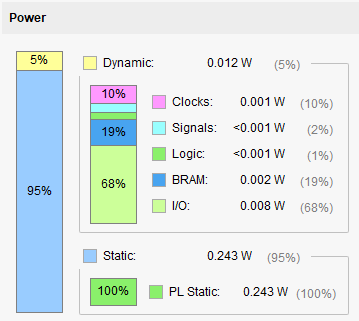
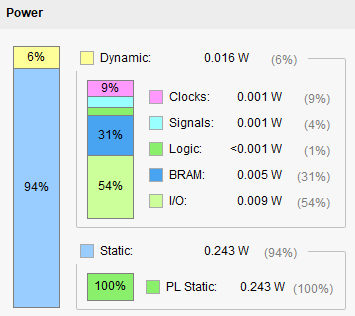
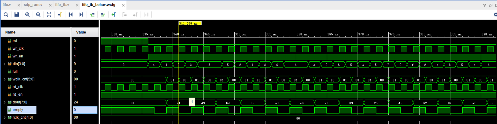

# <center>RAM模块与FIFO模块使用说明书</center>

# <center>目录</center>

<!-- @import "[TOC]" {cmd="toc" depthFrom=1 depthTo=6 orderedList=false} -->

<!-- code_chunk_output -->

- [<center>RAM模块与FIFO模块使用说明书</center>](#centerram模块与fifo模块使用说明书center)
- [<center>目录</center>](#center目录center)
- [<center>版本记录</center>](#center版本记录center)
- [一、单端口RAM模块使用说明](#一单端口ram模块使用说明)
  - [1 例化模板](#1-例化模板)
  - [2 端口描述](#2-端口描述)
  - [3 参数描述](#3-参数描述)
  - [4 行为仿真](#4-行为仿真)
    - [4.1 激励模块](#41-激励模块)
    - [4.2 仿真结果](#42-仿真结果)
  - [5 注意事项](#5-注意事项)
  - [6 编程思路](#6-编程思路)
  - [7 sp_ram模块与Xilinx官方IP核的综合结果对比](#7-sp_ram模块与xilinx官方ip核的综合结果对比)
    - [1 对比代码](#1-对比代码)
    - [2 对比结果](#2-对比结果)
      - [1 时序对比](#1-时序对比)
      - [2 资源对比](#2-资源对比)
      - [3 功耗对比](#3-功耗对比)
- [二、简单双端口RAM模块使用说明](#二简单双端口ram模块使用说明)
  - [1 例化模板](#1-例化模板-1)
  - [2 端口描述](#2-端口描述-1)
  - [3 参数描述](#3-参数描述-1)
  - [4 行为仿真](#4-行为仿真-1)
    - [4.1 激励模块](#41-激励模块-1)
    - [4.2 仿真结果](#42-仿真结果-1)
  - [5 注意事项](#5-注意事项-1)
  - [6 编程思路](#6-编程思路-1)
  - [7 sdp_ramm模块与Xilinx官方IP核的综合结果对比](#7-sdp_ramm模块与xilinx官方ip核的综合结果对比)
    - [1 时序对比](#1-时序对比-1)
    - [2 资源对比](#2-资源对比-1)
    - [3 功耗对比](#3-功耗对比-1)
- [三、真双端口RAM模块使用说明](#三真双端口ram模块使用说明)
  - [1 例化模板](#1-例化模板-2)
  - [2 端口描述](#2-端口描述-2)
  - [3 参数描述](#3-参数描述-2)
  - [4 行为仿真](#4-行为仿真-2)
    - [4.1 激励模块](#41-激励模块-2)
    - [4.2 仿真结果](#42-仿真结果-2)
  - [5 注意事项](#5-注意事项-2)
  - [6 编程思路](#6-编程思路-2)
  - [7 tdp_ram模块与Xilinx官方IP核的综合结果对比](#7-tdp_ram模块与xilinx官方ip核的综合结果对比)
    - [1 对比代码](#1-对比代码-1)
    - [2 对比结果](#2-对比结果-1)
      - [1 时序对比](#1-时序对比-2)
      - [2 资源对比](#2-资源对比-2)
      - [3 功耗对比](#3-功耗对比-2)
- [四、FIFO模块使用说明](#四fifo模块使用说明)
  - [1 例化模板](#1-例化模板-3)
  - [2 端口描述](#2-端口描述-3)
  - [3 参数描述](#3-参数描述-3)
  - [4 行为仿真](#4-行为仿真-3)
    - [4.1 激励模块](#41-激励模块-3)
    - [4.2 仿真结果](#42-仿真结果-3)
  - [5 注意事项](#5-注意事项-3)
  - [6 编程思路](#6-编程思路-3)
  - [7 FIFO模块与Xilinx官方IP核的综合结果对比](#7-fifo模块与xilinx官方ip核的综合结果对比)
    - [1 异步FIFO时序对比](#1-异步fifo时序对比)
    - [2 异步FIFO资源对比](#2-异步fifo资源对比)
    - [3 异步FIFO功耗对比](#3-异步fifo功耗对比)
    - [4 同步FIFO时序对比](#4-同步fifo时序对比)
    - [5 同步FIFO资源对比](#5-同步fifo资源对比)
    - [6 同步FIFO功耗对比](#6-同步fifo功耗对比)
- [五、BUG记录](#五bug记录)
  - [BUG1](#bug1)
  - [BUG2](#bug2)
  - [BUG3](#bug3)
  - [BUG4](#bug4)

<!-- /code_chunk_output -->

# <center>版本记录</center>

| 序号  |    日期    | 版本  | 变更内容 |
| :---: | :--------: | :---: | --- |
|   1   | 2022.07.22 | V1.0  | 初始版本发布|
|   2   | 2022.08.08 | V1.1  | 将真双端口RAM和FIFO模块的异步复位修改为高电平同步复位。|
|   3   | 2022.08.09 | V1.2  | 优化了单端口RAM和真双端口RAM模块当写数据位宽大于读数据位宽时的read_first模式。优化前：写入一个数据之后，需要等待将RAM在写地址上的原始数据读出才能写下一个数据。优化后：写入一个数据之后，不需要等待可直接写下一个数据，仅当需要完整的读出写地址上的数据时才需要等待将RAM在写地址上的原始数据读出才能写下一个数据。 |
|   4   | 2022.08.10 | V1.3  | 将FIFO高电平同步复位改为上升沿异步复位。|
|   5   | 2022.09.28 | V1.4  | 修改了各个模块实现结果不是BRAM的BUG。|
|   6   | 2022.10.17 | V1.5  | 修改完所有BUG，正式使用版发布。|
|   7   | 2022.10.19 | V1.6  | 简化了所有模块的例化参数，使例化更加方便。|

# 一、单端口RAM模块使用说明
## 1 例化模板
模板使用说明：只需将例化模板复制粘贴到用户的模块中，然后将例化参数、例化模块名和输入输出端口名按照用户需求更改。需要注意的是读地址的深度已在模块内部自动计算得出，无需用户配置。addr端口的位宽在模块内部为读写地址位宽中的最大位宽，用户例化时需手动计算得出读写地址位宽中的最大位宽作为外部连接addr端口的地址位宽。
```verilog
sp_ram #(
    .WD_WIDTH ( 8             ),    //write data width     
    .WA_DEPTH ( 4096          ),    //write addr depth
    .RD_WIDTH ( 8             ),    //read data width
    .DELAY    ( 0             ),    //Select the clock period for delayed output. The value can be 0,1,2
    .MODE     ( "write_first" ),    //write_first, read_first, no_change
    .TYPE     ( "block"       ))    //block,distributed  
 your_instance_name (
    .rst      ( rst    ),   //input [0:0] rst active-HIGH
    .clk      ( clk    ),   //input [0:0] clk
    .en       ( en     ),   //input [0:0] en
    .we       ( we     ),   //input [0:0] we
    .addr     ( addr   ),   //input [ADDRMAX_WIDTH-1:0] addr
    .din      ( din    ),   //input [WD_WIDTH-1:0] din
    .dout     ( dout   )    //output [RD_WIDTH-1:0] dout
);
```
## 2 端口描述
| 端口名 | 方向  |     宽度      | 时钟域 | 功能                                      |
| :----: | :---: | :-----------: | :----: | ----------------------------------------- |
|  rst   | input |       1       |  clk   | 高电平同步复位                            |
|  clk   | input |       1       |  clk   | 时钟                                      |
|   en   | input |       1       |  clk   | 模块使能                                  |
|   we   | input |       1       |  clk   | 读写控制端口，为1时写数据，为0时读数据。  |
|  addr  | input | ADDRMAX_WIDTH |  clk   | 读写数据的地址,宽度以更深的地址位宽为准。 |
|  din   | input |   WD_WIDTH    |  clk   | 写数据端口，宽度为写数据的位宽。          |
|  dout  | ouput |   RD_WIDTH    |  clk   | 读数据端口，宽度为读数据的宽度。          |

## 3 参数描述
|    参数名     | 数据类型 |               允许范围               |   默认值    | 描述                                                                                                                                                                              |
| :-----------: | :------: | :----------------------------------: | :---------: | --------------------------------------------------------------------------------------------------------------------------------------------------------------------------------- |
|   WD_WIDTH    |  十进制  |               1到4608                |      8      | 写数据的位宽。                                                                                                                                                                    |
|   WA_DEPTH    |  十进制  |            由实际资源而定            |    4096     | 写数据的深度。                                                                                                                                                                    |
|   RD_WIDTH    |  十进制  |               1到4608                |      8      | 读数据的位宽。                                                                                                                                                                    |
|     DELAY     |  十进制  |                0,1,2                 |      0      | 读取数据相对于读使能信号的延时，0表示不延时，读使能立即输出数据。1表示在读使能之后的第一个时钟上升沿输出数据。2表示在读使能之后的第二个时钟上升沿输出数据。                       |
|     MODE      |  字符串  |  write_first, read_first, no_change  | write_first | write_first:在写操作时，输出端口输出当前写入的数据。read_first:写操作时，输出端口输出当前写地址的原始数据。no_change:写操作时输出端口保持不变。输出端口只在读取操作期间发生变化。 |
|     TYPE      |  字符串  |          block,distributed           |    block    | Block:表示使用的RAM为BRAM。Distributed：表示使用的RAM为DRAM。                                                                                                                     |
|   WA_WIDTH    |   默认   |           $clog2(WA_DEPTH)           |     12      | WA_DEPTH以2为底的对数，表示写地址的位宽。                                                                                                                                         |
|   RA_DEPTH    |   默认   |      WD_WIDTH*WA_DEPTH/RD_WIDTH      |    4096     | 读深度。                                                                                                                                                                          |
|   RA_WIDTH    |   默认   |           $clog2(RA_DEPTH)           |     12      | RA_DEPTH以2为底的对数，表示读地址的位宽。                                                                                                                                         |
| ADDRMAX_WIDTH |   默认   | WA_WIDTH>=RA_WIDTH?WA_WIDTH:RA_WIDTH |  RA_WIDTH   | 得到更宽的地址位宽。                                                                                                                                                              |

## 4 行为仿真
### 4.1 激励模块
```verilog
`timescale  1ns / 1ns

module sp_ram_tb;

// sp_ram Parameters
parameter PERIOD         = 10                                  ;
parameter WD_WIDTH       = 4                                   ;
parameter WA_DEPTH       = 32                                  ;
parameter RD_WIDTH       = 8                                   ;
parameter DELAY          = 0                                   ;
parameter MODE           = "write_first"                       ;
parameter TYPE           = "block"                             ;
parameter WA_WIDTH       = $clog2(WA_DEPTH)                    ;
parameter RA_DEPTH       = WD_WIDTH*WA_DEPTH/RD_WIDTH          ;
parameter RA_WIDTH       = $clog2(RA_DEPTH)                    ;
parameter ADDRMAX_WIDTH  = WA_WIDTH>=RA_WIDTH?WA_WIDTH:RA_WIDTH;

// sp_ram Inputs
reg   rst_n                                = 0 ;
reg   clk                                  = 0 ;
reg   en                                   = 0 ;
reg   we                                   = 0 ;
reg   [ADDRMAX_WIDTH-1:0]  addr            = 0 ;
reg   [WD_WIDTH-1:0]  din                  = 0 ;

// sp_ram Outputs
wire  [RD_WIDTH-1:0]  dout                 ;


initial
begin
    forever #(PERIOD/2)  clk=~clk;
end

initial
begin
    #(PERIOD*2) rst_n  =  1;
end

sp_ram #(
    .WD_WIDTH ( WD_WIDTH ),
    .WA_DEPTH ( WA_DEPTH ),
    .RD_WIDTH ( RD_WIDTH ),
    .DELAY    ( DELAY    ),
    .MODE     ( MODE     ),
    .TYPE     ( TYPE     ))
 u_sp_ram (
    .rst      ( rst  ),
    .clk      ( clk  ),
    .en       ( en   ),
    .we       ( we   ),
    .addr     ( addr ),
    .din      ( din  ),
    .dout     ( dout )
);

initial begin
    #(PERIOD)
    rst_n=1;
    en=1;
    din=0;
    we=1;
    #(PERIOD)
    repeat(32) begin
        #(PERIOD*1)
        @(negedge clk) ;
        addr =addr+1;
        din=din+1;
    end

    #(PERIOD*5)
    en=1;
    we=0;
    addr =0;
    #(PERIOD)
    repeat(16) begin
        @(negedge clk) ;
        addr =addr+1;
        din=0;
    end
    $stop;
end

endmodule
```
### 4.2 仿真结果
1. 读写数据位宽相同，读数据延时0个时钟周期，write_first模式，图中展示在写数据的过程中，输出的数据为写入的数据。

2. 读写数据位宽相同，读数据延时0个时钟周期，read_first模式。图中展示在写数据的过程中，输出的数据为写地址上的原始数据。

3. 读写数据位宽相同，读数据延时1个时钟周期，read_first模式。图中展示在读数据时延时了1个时钟周期输出，即打了一拍。

4. 读写数据位宽相同，读数据延时2个时钟周期，read_first模式。图中展示在读数据时延时了2个时钟周期输出，即打了两拍。

5. 读写数据位宽相同，读数据延时0个时钟周期，no_change模式。图中展示了在写数据的过程中，输出数据保持不变。

6. 写数据位宽大于读数据位宽，读延时0个时钟周期，write_first模式。第一幅图展示了连续写数据时输出为间隔的写数据，若想输出每个写数据，需要间隔适当的时钟周期写入数据。第二幅图展示了读数据时，先读出的是对应8位数据的低4位。


7. 写数据位宽大于读数据位宽，读延时0个时钟周期，read_first模式。图中展示在写数据的过程中，输出的数据为写地址上的原始数据。

8. 写数据位宽大于读数据位宽，读延时0个时钟周期，no_change模式。图中展示在写数据的过程中，输出的数据保持不变。

9. 写数据位宽小于读数据位宽，读延时0个时钟周期，write_first模式。图一中展示在写数据的过程中，输出写入的数据，且读数据的低位为先写入的数据。图二展示了读数据，读出的数据低位也是先写入的数据。


10. 写数据位宽小于读数据位宽，读延时0个时钟周期，read_first模式。图中展示在写数据的过程中，输出的数据为写地址上的原始数据。

11. 写数据位宽小于读数据位宽，读延时0个时钟周期，no_change模式。图中展示在写数据的过程中，输出的数据保持不变。


## 5 注意事项
1. 如果读端口的位宽小于写端口，当读数据时，先读到的是写入数据的低位。如果读端口的位宽大于写端口，当读数据时，读到的数据低位为先写入的数据，高位为后写入的数据。

2. 复位时间需要超过较长的时钟周期才能稳定复位。 

## 6 编程思路
单端口RAM模块，根据读写数据宽度的关系分为三种情况来处理，每种情况分为三种模式如下图所示。


## 7 sp_ram模块与Xilinx官方IP核的综合结果对比
### 1 对比代码
值得注意的是这仅仅是读写位宽相等情况的结果对比。对比代码如下：
```verilog
module ram_top(rst,clk,en,we,dout);

// sp_ram Parameters
parameter WD_WIDTH       = 8                                   ;
parameter WA_DEPTH       = 4096                                 ;
parameter RD_WIDTH       = 8                                 ;
parameter DELAY          = 0                                   ;
parameter MODE           = "write_first"                       ;
parameter TYPE           = "block"                             ;
parameter WA_WIDTH       = $clog2(WA_DEPTH)                     ;
parameter RA_DEPTH       = WD_WIDTH*WA_DEPTH/RD_WIDTH          ;
parameter RA_WIDTH       = $clog2(RA_DEPTH)                     ;
parameter ADDRMAX_WIDTH  = WA_WIDTH>=RA_WIDTH?WA_WIDTH:RA_WIDTH;

input rst;
input clk;
input en;
input we;
output [RD_WIDTH-1:0] dout;

// sp_ram Inputs
reg   [ADDRMAX_WIDTH-1:0]  addr            = 0 ;
reg   [WD_WIDTH-1:0]  din                  = 0 ;

//sp_ram #(
//    .WD_WIDTH (WD_WIDTH             ),    //write data width     
//    .WA_DEPTH ( WA_DEPTH          ),    //write addr depth
//    .RD_WIDTH ( RD_WIDTH             ),    //read data width
//    .DELAY    ( DELAY             ),    //Select the clock period for delayed output. The value can be 0,1,2
//    .MODE     ( MODE ),    //write_first, read_first, no_change
//    .TYPE     ( TYPE       ))    //block,distributed  
// your_instance_name (
//    .rst      ( rst    ),   //input [0:0] rst active-HIGH
//    .clk      ( clk    ),   //input [0:0] clk
//    .en       ( en     ),   //input [0:0] en
//    .we       ( we     ),   //input [0:0] we
//    .addr     ( addr   [ADDRMAX_WIDTH-1:0]    ),   //input [ADDRMAX_WIDTH-1:0] addr
//    .din      ( din    [WD_WIDTH-1:0]    ),   //input [WD_WIDTH-1:0] din
//    .dout     ( dout   [RD_WIDTH-1:0]   )    //output [RD_WIDTH-1:0] dout
//);

blk_mem_gen_0 your_instance_name (
  .clka(clk),    // input wire clka
  .ena(en),      // input wire ena
  .wea(we),      // input wire [0 : 0] wea
  .addra(addr[ADDRMAX_WIDTH-1:0]),  // input wire [11 : 0] addra
  .dina(din[WD_WIDTH-1:0]),    // input wire [7 : 0] dina
  .douta(dout[RD_WIDTH-1:0])  // output wire [7 : 0] douta
);

always @(posedge clk) begin
    if (rst) begin
        addr<=0;
        din<=0;
    end
    else if (en) begin
        if (we) begin
            addr<=addr+1;
            din<=din+1;
        end
        else begin
            addr<=addr+1;
        end
    end
end

endmodule
```
### 2 对比结果
#### 1 时序对比
sp_ram模块:


IP核：


结果分析：sp_ram模块相比于官方IP核时序较差，有待进一步优化。
#### 2 资源对比
sp_ram模块:


IP核：


结果分析：sp_ram模块相比于官方IP核占用资源较多，主要是因为sp_ram模块比官方IP核多了复位功能。
#### 3 功耗对比
sp_ram模块:


IP核：


结果分析：sp_ram模块的功耗情况与官方IP核功耗完全一致。
# 二、简单双端口RAM模块使用说明
## 1 例化模板
模板使用说明：只需将例化模板复制粘贴到用户的模块中，然后将例化参数、例化模块名和输入输出端口名按照用户需求更改。需要注意的是waddr、din、raddr和dout端口的位宽要和对应的参数相匹配。
```verilog
sdp_ram #(
    .WD_WIDTH ( 8       ),  //write data width
    .WA_DEPTH ( 4096    ),  //write address depth
    .RD_WIDTH ( 8       ),  //read data width
    .DELAY    ( 0       ),  //Select the clock period for delayed output. The value can be 0,1,2
    .TYPE     ( "block" ))  //block,distributed
 your_instance_name (
    .wr_clk   ( wr_clk ),   //input [0:0] wr_clk
    .wr_en    ( wr_en  ),   //input [0:0] wr_en
    .waddr    ( waddr  ),   //input [WA_WIDTH-1:0] waddr
    .din      ( din    ),   //input [WD_WIDTH-1:0] din
    .rd_clk   ( rd_clk ),   //input [0:0] rd_clk
    .rd_en    ( rd_en  ),   //input [0:0] rd_en
    .raddr    ( raddr  ),   //input [RA_WIDTH-1:0] raddr
    .dout     ( dout   )    //input [RD_WIDTH-1:0] dout
);
```
## 2 端口描述
| 端口名 | 方向  |   宽度   | 时钟域 |    功能    |
| :----: | :---: | :------: | :----: | :--------: |
| wr_clk | input |    1     | wr_clk |   写时钟   |
| wr_en  | input |    1     | wr_clk |   写使能   |
| waddr  | input | WA_WIDTH | wr_clk |   写地址   |
|  din   | input | WD_WIDTH | wr_clk | 写数据端口 |
| rd_clk | input |    1     | rd_clk |   读时钟   |
| rd_en  | input |    1     | rd_clk |   读使能   |
| raddr  | Input | RA_WIDTH | rd_clk |   读地址   |
|  dout  | ouput | RD_WIDTH | rd_clk | 读数据端口 |

## 3 参数描述
|  参数名  | 数据类型 |          允许范围          | 默认值 | 描述                                                                                                                                                        |
| :------: | :------: | :------------------------: | :----: | ----------------------------------------------------------------------------------------------------------------------------------------------------------- |
| WD_WIDTH |  十进制  |          1到4608           |   8    | 写数据的位宽。                                                                                                                                              |
| WA_DEPTH |  十进制  |       由实际资源而定       |  4096  | 写数据的深度。                                                                                                                                              |
| RD_WIDTH |  十进制  |          1到4608           |   8    | 读数据的位宽。                                                                                                                                              |
|  DELAY   |  十进制  |           0,1,2            |   0    | 读取数据相对于读使能信号的延时，0表示不延时，读使能立即输出数据。1表示在读使能之后的第一个时钟上升沿输出数据。2表示在读使能之后的第二个时钟上升沿输出数据。 |
|   TYPE   |  字符串  |     block,distributed      | block  | Block:表示使用的RAM为BRAM。Distributed：表示使用的RAM为DRAM。                                                                                               |
| WA_WIDTH |   默认   |      $clog2(WA_DEPTH)      |   12   | 写深度以2为底的对数，表示写数据位宽。                                                                                                                       |
| RA_DEPTH |   默认   | WD_WIDTH*WA_DEPTH/RD_WIDTH |  4096  | 读深度                                                                                                                                                      |
| RA_WIDTH |   默认   |      $clog2(RA_DEPTH)      |   12   | 读深度以2为底的对数，表示读地址的位宽。                                                                                                                     |
## 4 行为仿真
### 4.1 激励模块
```verilog
`timescale  1ns / 1ns

module sdp_ram_tb;

// sdp_ram Parameters
parameter PERIOD    = 10                        ;
parameter WD_WIDTH  = 4                         ;
parameter WA_DEPTH  = 32                        ;
parameter RD_WIDTH  = 8                         ;
parameter DELAY     = 0                         ;
parameter TYPE      = "block"                   ;
parameter WA_WIDTH  = $clog2(WA_DEPTH)          ;
parameter RA_DEPTH  = WD_WIDTH*WA_DEPTH/RD_WIDTH;
parameter RA_WIDTH  = $clog2(RA_DEPTH)          ;

// sdp_ram Inputs
reg   clk                                  = 0 ;
reg   wr_en                                = 0 ;
reg   [WA_WIDTH-1:0]  waddr                = 0 ;
reg   [WD_WIDTH-1:0]  din                  = 0 ;
reg   rd_en                                = 0 ;
reg   [RA_WIDTH-1:0]  raddr                = 0 ;

// sdp_ram Outputs
wire  [RD_WIDTH-1:0]  dout                 ;


initial
begin
    forever #(PERIOD/2)  clk=~clk;
end

sdp_ram #(
    .WD_WIDTH ( WD_WIDTH ),
    .WA_DEPTH ( WA_DEPTH ),
    .RD_WIDTH ( RD_WIDTH ),
    .DELAY    ( DELAY    ),
    .TYPE     ( TYPE     ))
 u_sdp_ram (
    .wr_clk                  ( wr_clk                 ),
    .wr_en                   ( wr_en                  ),
    .waddr                   ( waddr   [WA_WIDTH-1:0] ),
    .din                     ( din     [WD_WIDTH-1:0] ),
    .rd_clk                  ( rd_clk                 ),
    .rd_en                   ( rd_en                  ),
    .raddr                   ( raddr   [RA_WIDTH-1:0] ),
    .dout                    ( dout    [RD_WIDTH-1:0] )
);

initial begin    
    #(PERIOD)
    wr_en=1;
    din=0;
    #(PERIOD)
    repeat(32) begin
        @(negedge clk) ;
        waddr =waddr+1;
        din=din+1;
    end
    din=0;

    #(PERIOD*5)
    rd_en=1;
    raddr = 0;
    #(PERIOD)
    repeat(16) begin
        @(negedge clk) ;
        raddr =raddr+1;
        din=0;
    end
    $stop;
end

endmodule
```
### 4.2 仿真结果
1. 写位宽等于读位宽，读数据延时0个时钟周期。

2. 写位宽大于读位宽，读数据延时0个时钟周期。先读出的数据对应写入数据的低位。

3. 写位宽小于读位宽，读数据延时0个时钟周期。先写入的数据为读出数据的低位。


## 5 注意事项
1. 如果读端口的位宽小于写端口，当读数据时，先读到的是写入数据的低位。如果读端口的位宽大于写端口，当读数据时，读到的数据低位为先写入的数据，高位为后写入的数据。 
## 6 编程思路
简单双端口RAM模块，根据读写数据宽度分为如下图所示三种情况处理，读端口负责读，写端口负责写。


## 7 sdp_ramm模块与Xilinx官方IP核的综合结果对比
值得注意的是这仅仅是读写位宽相等情况的结果对比。
### 1 时序对比
sdp_ram模块:


IP核：


### 2 资源对比
sdp_ram模块:


IP核：


### 3 功耗对比
sp_ram模块:


IP核：


结果分析：sdp_ram模块与Xilinx官方IP核的时序分析结果、资源占用和功耗完全相同。
# 三、真双端口RAM模块使用说明
## 1 例化模板
模板使用说明：只需将例化模板复制粘贴到用户的模块中，然后将例化参数、例化模块名和输入输出端口名按照用户需求更改。需要注意的是addra/addrb、dina/dinb和douta/doutb端口的位宽要和对应的参数相匹配。
```verilog
tdp_ram #(
    .WD_WIDTHA ( 8             ),   //write data width
    .WA_DEPTHA ( 4096          ),   //write address depth
    .RD_WIDTHA ( 8             ),   //read data width
    .DELAYA    ( 0             ),   //Select the clock period for delayed output. The value can be 0,1,2
    .MODEA     ( "write_first" ),   //write_first, read_first, no_change
    .WD_WIDTHB ( 8             ),   //write data width   
    .WA_DEPTHB ( 4096          ),   //write address depth
    .RD_WIDTHB ( 8             ),   //read data width
    .DELAYB    ( 0             ),   //Select the clock period for delayed output. The value can be 0,1,2
    .MODEB     ( "write_first" ),   //write_first, read_first, no_change
    .TYPE      ( "block"       ))   //block,distributed
 your_instance_name (
    .rst       ( rst   ),   //input [0:0] rst active-HIGH
    .clka      ( clka  ),   //input [0:0] clka
    .ena       ( ena   ),   //input [0:0] ena
    .wea       ( wea   ),   //input [0:0] wea
    .addra     ( addra ),   //input [ADDRMAX_WIDTHA-1:0] addra
    .dina      ( dina  ),   //input [WD_WIDTHA-1:0] dina
    .douta     ( douta ),   //output [RD_WIDTHA-1:0] douta
    .clkb      ( clkb  ),   //input [0:0] clkb
    .enb       ( enb   ),   //input [0:0] enb
    .web       ( web   ),   //input [0:0] web
    .addrb     ( addrb ),   //input [ADDRMAX_WIDTHB-1:0] addrb
    .dinb      ( dinb  ),   //input [WD_WIDTHB-1:0] dinb
    .doutb     ( doutb )    //output [RD_WIDTHB-1:0] doutb
);
```
## 2 端口描述
| 端口名 |  方向  |        宽度        |   时钟域   | 功能                                      |
| :----: | :----: | :----------------: | :--------: | ----------------------------------------- |
|  rst   | input  |         1          | clka和clkb | 高电平同步复位                            |
|  clka  | input  |         1          |    clka    | 端口a时钟                                 |
|  ena   | input  |         1          |    clka    | 端口a使能                                 |
|  wea   | input  |         1          |    clka    | 端口a读写控制，为1时写数据，为0时读数据。 |
| addra  | input  | $clog2(DATA_DEPTH) |    clka    | 端口a读写地址                             |
|  dina  | input  |     DATA_WIDTH     |    clka    | 端口a写数据端口                           |
| douta  | output |     DATA_WIDTH     |    clka    | 端口a读数据端口                           |
|  clkb  | input  |         1          |    clkb    | 端口b时钟                                 |
|  enb   | input  |         1          |    clkb    | 端口b使能                                 |
|  web   | input  |         1          |    clkb    | 端口b读写控制，为1时写数据，为0时读数据。 |
| addrb  | input  | $clog2(DATA_DEPTH) |    clkb    | 端口b读写地址                             |
|  dinb  | input  |     DATA_WIDTH     |    clkb    | 端口b写数据端口                           |
| doutb  | output |     DATA_WIDTH     |    clkb    | 端口b读数据端口                           |

## 3 参数描述
|     参数名     | 数据类型 |                 允许范围                 |   默认值    | 描述                                                                                                                                                                                             |
| :------------: | :------: | :--------------------------------------: | :---------: | ------------------------------------------------------------------------------------------------------------------------------------------------------------------------------------------------ |
|      TYPE      |  字符串  |            block,distributed             |    block    | Block:表示使用的RAM为BRAM。Distributed：表示使用的RAM为DRAM                                                                                                                                      |
|   WD_WIDTHA    |  十进制  |                 1到4608                  |      8      | A端口的写数据宽度                                                                                                                                                                                |
|   WA_DEPTHA    |  十进制  |              由实际资源而定              |    4096     | A端口写数据深度                                                                                                                                                                                  |
|   RD_WIDTHA    |  十进制  |                 1到4608                  |      8      | A端口读数据宽度                                                                                                                                                                                  |
|     DELAYA     |  十进制  |                  0,1,2                   |      0      | A端口读取数据相对于读使能信号的延时，0表示不延时，读使能立即输出数据。1表示在读使能之后的第一个时钟上升沿输出数据。2表示在读使能之后的第二个时钟上升沿输出数据。                                 |
|     MODEA      |  字符串  |    write_first, read_first, no_change    | write_first | A端口模式//write_first:在写操作时，输出端口输出当前写入的数据。//read_first:写操作时，输出端口输出当前写地址的原始数据。//no_change:写操作时输出端口保持不变。输出端口只在读取操作期间发生变化。 |
|   WA_WIDTHA    |   默认   |            $clog2(WA_DEPTHA)             |     12      | A端口写深度以2为底的对数                                                                                                                                                                         |
|   RA_DEPTHA    |   默认   |      WD_WIDTHA*WA_DEPTHA/RD_WIDTHA       |    4096     | A端口读深度                                                                                                                                                                                      |
|   RA_WIDTHA    |   默认   |            $clog2(RA_DEPTHA)             |     12      | A端口读深度以2为底的对数                                                                                                                                                                         |
| ADDRMAX_WIDTHA |   默认   | WA_WIDTHA>=RA_WIDTHA?WA_WIDTHA:RA_WIDTHA |     12      | A端口最大的深度位宽                                                                                                                                                                              |
|   WD_WIDTHB    |  十进制  |                 1到4608                  |      8      | B端口的写数据宽度                                                                                                                                                                                |
|   WA_DEPTHB    |  十进制  |              由实际资源而定              |    4096     | B端口写数据深度                                                                                                                                                                                  |
|   RD_WIDTHB    |  十进制  |                 1到4608                  |      8      | B端口读数据宽度                                                                                                                                                                                  |
|     DELAYB     |  十进制  |                  0,1,2                   |      0      | B端口读取数据相对于读使能信号的延时，0表示不延时，读使能立即输出数据。1表示在读使能之后的第一个时钟上升沿输出数据。2表示在读使能之后的第二个时钟上升沿输出数据。                                 |
|     MODEB      |  字符串  |    write_first, read_first, no_change    | write_first | B端口模式//write_first:在写操作时，输出端口输出当前写入的数据。//read_first:写操作时，输出端口输出当前写地址的原始数据。//no_change:写操作时输出端口保持不变。输出端口只在读取操作期间发生变化。 |
|   WA_WIDTHB    |   默认   |            $clog2(WA_DEPTHB)             |     12      | B端口写深度以2为底的对数                                                                                                                                                                         |
|   RA_DEPTHB    |   默认   |      WD_WIDTHB*WA_DEPTHB/RD_WIDTHB       |    4096     | B端口读深度                                                                                                                                                                                      |
|   RA_WIDTHB    |   默认   |            $clog2(RA_DEPTHB)             |     12      | B端口读深度以2为底的对数                                                                                                                                                                         |
| ADDRMAX_WIDTHB |   默认   | WA_WIDTHB>=RA_WIDTHB?WA_WIDTHB:RA_WIDTHB |     12      | B端口最大的深度位宽                                                                                                                                                                              |

## 4 行为仿真
### 4.1 激励模块
```verilog
`timescale  1ns / 1ns

module tdp_ram_tb;

// tdp_ram Parameters
parameter PERIOD          = 10                                      ;
parameter WD_WIDTHA       = 4                                       ;
parameter WA_DEPTHA       = 32                                      ;
parameter RD_WIDTHA       = 8                                       ;
parameter DELAYA          = 0                                       ;
parameter MODEA           = "write_first"                           ;
parameter WA_WIDTHA       = $clog2(WA_DEPTHA)                       ;
parameter RA_DEPTHA       = WD_WIDTHA*WA_DEPTHA/RD_WIDTHA           ;
parameter RA_WIDTHA       = $clog2(RA_DEPTHA)                       ;
parameter ADDRMAX_WIDTHA  = WA_WIDTHA>=RA_WIDTHA?WA_WIDTHA:RA_WIDTHA;
parameter WD_WIDTHB       = 8                                       ;
parameter WA_DEPTHB       = 16                                      ;
parameter RD_WIDTHB       = 16                                      ;
parameter DELAYB          = 0                                       ;
parameter MODEB           = "write_first"                           ;
parameter WA_WIDTHB       = $clog2(WA_DEPTHB)                       ;
parameter RA_DEPTHB       = WD_WIDTHB*WA_DEPTHB/RD_WIDTHB           ;
parameter RA_WIDTHB       = $clog2(RA_DEPTHB)                       ;
parameter ADDRMAX_WIDTHB  = WA_WIDTHB>=RA_WIDTHB?WA_WIDTHB:RA_WIDTHB;
parameter TYPE            = "block"                                 ;
  
// tdp_ram Inputs
reg   rst                                  = 1 ;
reg   clka                                 = 0 ;
reg   ena                                  = 0 ;
reg   wea                                  = 0 ;
reg   [ADDRMAX_WIDTHA-1:0]  addra          = 0 ;
reg   [WD_WIDTHA-1:0]  dina                = 0 ;
reg   clkb                                 = 0 ;
reg   enb                                  = 0 ;
reg   web                                  = 0 ;
reg   [ADDRMAX_WIDTHB-1:0]  addrb          = 0 ;
reg   [WD_WIDTHB-1:0]  dinb                = 0 ;

// tdp_ram Outputs
wire  [RD_WIDTHA-1:0]  douta               ;
wire  [RD_WIDTHB-1:0]  doutb               ;
  

always #(PERIOD/2)  clka=~clka;  
always #(PERIOD/2)  clkb=~clkb;  

  
initial  
begin  
    #(PERIOD) rst  =  0;  
end  
  
tdp_ram #(
    .WD_WIDTHA ( WD_WIDTHA ),
    .WA_DEPTHA ( WA_DEPTHA ),
    .RD_WIDTHA ( RD_WIDTHA ),
    .DELAYA    ( DELAYA    ),
    .MODEA     ( MODEA     ),
    .WD_WIDTHB ( WD_WIDTHB ),
    .WA_DEPTHB ( WA_DEPTHB ),
    .RD_WIDTHB ( RD_WIDTHB ),
    .DELAYB    ( DELAYB    ),
    .MODEB     ( MODEB     ),
    .TYPE      ( TYPE      ))
 u_tdp_ram (
    .rst                     ( rst                         ),
    .clka                    ( clka                        ),
    .ena                     ( ena                         ),
    .wea                     ( wea                         ),
    .addra                   ( addra  [ADDRMAX_WIDTHA-1:0] ),
    .dina                    ( dina   [WD_WIDTHA-1:0]      ),
    .clkb                    ( clkb                        ),
    .enb                     ( enb                         ),
    .web                     ( web                         ),
    .addrb                   ( addrb  [ADDRMAX_WIDTHB-1:0] ),
    .dinb                    ( dinb   [WD_WIDTHB-1:0]      ),
    .douta                   ( douta  [RD_WIDTHA-1:0]      ),
    .doutb                   ( doutb  [RD_WIDTHB-1:0]      )
);


initial begin   
    //port A write 
    #(PERIOD)
    ena=1;
    wea=1;
    addra=0;
    dina=0;

    enb=0;
    web=0;
    addrb=0;
    dinb=0;
    #(PERIOD)
    repeat(32) begin
    //    #(PERIOD*2)
        @(negedge clka) ;
        addra = addra + 1'b1 ;
        dina = dina + 1'b1 ;
    end
    addra=0;
    dina=0;

    //port A  read
    #(PERIOD*5)
    ena=1;
    wea=0;
    addra=0;
    dina=0;

    enb=0;
    web=0;
    addrb=0;
    dinb=0;
    #(PERIOD)
    repeat(16) begin
        @(negedge clka) ;
        addra = addra + 1'b1 ;
    end
    addra = 0 ;

    #(PERIOD*5)

    //port B  read
    ena=0;
    wea=0;
    addra=0;
    dina=0;

    enb=1;
    web=0;
    addrb=0;
    dinb=0;
    #(PERIOD)
    repeat(8) begin
        @(negedge clkb) ;
        addrb = addrb + 1'b1 ;
    end
    addrb = 0 ;

    //port B write
    #(PERIOD*5)
    ena=0;
    wea=0;
    addra=0;
    dina=0;

    enb=1;
    web=1;
    addrb=0;
    dinb=0;
    #(PERIOD)
    repeat(16) begin
        //    #(PERIOD*2)
        @(negedge clkb) ;
        dinb = dinb - 1'b1 ;
        addrb = addrb + 1'b1 ;
    end
    dinb = 0 ;
    addrb = 0;


    //port A  read
    #(PERIOD*5)
    ena=1;
    wea=0;
    addra=0;
    dina=0;

    enb=0;
    web=0;
    addrb=0;
    dinb=0;
    #(PERIOD)
    repeat(16) begin
        @(negedge clka) ;
        addra = addra + 1'b1 ;
    end
    addra = 0 ;

    #(PERIOD*5)
    //port B  read
    ena=0;
    wea=0;
    addra=0;
    dina=0;

    enb=1;
    web=0;
    addrb=0;
    dinb=0;
    #(PERIOD)
    repeat(8) begin
        @(negedge clkb) ;
        addrb = addrb + 1'b1 ;
    end
    addrb = 0 ;

    $stop;
end
endmodule
```
### 4.2 仿真结果
1. AB端口最大的数据位宽相等。A端口的读写位宽相等，延时0个时钟周期，为write_first模式；B端口的读写位宽相等，延时0个时钟周期，为write_first模式。

2. AB端口最大的数据位宽相等。A端口的读写位宽相等，延时0个时钟周期，为read_first模式；B端口的读写位宽相等，延时0个时钟周期，为read_first模式。

3. AB端口最大的数据位宽相等。A端口的读写位宽相等，延时0个时钟周期，为no_change模式；B端口的读写位宽相等，延时0个时钟周期，为no_change模式。

4. AB端口最大的数据位宽相等。A端口的读写位宽相等，延时1个时钟周期，为write_first模式；B端口的读写位宽相等，延时1个时钟周期，为write_first模式。


5. AB端口最大的数据位宽相等。A端口的读写位宽相等，延时2个时钟周期，为write_first模式；B端口的读写位宽相等，延时2个时钟周期，为write_first模式。


6. AB端口最大的数据位宽相等。A端口的写大于读位宽，延时0个时钟周期，为write_first模式；B端口的写大于读位宽，延时0个时钟周期，为write_first模式。

7. AB端口最大的数据位宽相等。A端口的写大于读位宽，延时0个时钟周期，为read_first模式；B端口的写大于读位宽，延时0个时钟周期，为read_first模式。

8. AB端口最大的数据位宽相等。A端口的写大于读位宽，延时0个时钟周期，为no_change模式；B端口的写大于读位宽，延时0个时钟周期，为no_change模式。

9. AB端口最大的数据位宽相等。A端口的写小于读位宽，延时0个时钟周期，为write_first模式；B端口的写小于读位宽，延时0个时钟周期，为write_first模式。

10. AB端口最大的数据位宽相等。A端口的写小于读位宽，延时0个时钟周期，为read_first模式；B端口的写小于读位宽，延时0个时钟周期，为read_first模式。

11. AB端口最大的数据位宽相等。A端口的写小于读位宽，延时0个时钟周期，为no_change模式；B端口的写小于读位宽，延时0个时钟周期，为no_change模式。

12. A端口最大的数据位宽大于B端口。A端口的写等于读位宽，延时0个时钟周期，为write_first模式；B端口的写等于读位宽，延时0个时钟周期，为write_first模式。

13. A端口最大的数据位宽大于B端口。A端口的写等于读位宽，延时0个时钟周期，为read_first模式；B端口的写等于读位宽，延时0个时钟周期，为read_first模式。

14. A端口最大的数据位宽大于B端口。A端口的写等于读位宽，延时0个时钟周期，为no_change模式；B端口的写等于读位宽，延时0个时钟周期，为no_change模式。

15. A端口最大的数据位宽大于B端口。A端口的写大于读位宽，延时0个时钟周期，为write_first模式；B端口的写大于读位宽，延时0个时钟周期，为write_first模式。

16. A端口最大的数据位宽大于B端口。A端口的写大于读位宽，延时0个时钟周期，为read_first模式；B端口的写大于读位宽，延时0个时钟周期，为read_first模式。

17. A端口最大的数据位宽大于B端口。A端口的写大于读位宽，延时0个时钟周期，为no_change模式；B端口的写大于读位宽，延时0个时钟周期，为no_change模式。

18. A端口最大的数据位宽大于B端口。A端口的写小于读位宽，延时0个时钟周期，为write_first模式；B端口的写小于读位宽，延时0个时钟周期，为write_first模式。

19. A端口最大的数据位宽大于B端口。A端口的写小于读位宽，延时0个时钟周期，为read_first模式；B端口的写小于读位宽，延时0个时钟周期，为read_first模式。

20. A端口最大的数据位宽大于B端口。A端口的写小于读位宽，延时0个时钟周期，为no_change模式；B端口的写小于读位宽，延时0个时钟周期，为no_change模式。

21. A端口最大的数据位宽小于B端口。A端口的写等于读位宽，延时0个时钟周期，为write_first模式；B端口的写等于读位宽，延时0个时钟周期，为write_first模式。

22. A端口最大的数据位宽小于B端口。A端口的写等于读位宽，延时0个时钟周期，为read_first模式；B端口的写等于读位宽，延时0个时钟周期，为read_first模式。

23. A端口最大的数据位宽小于B端口。A端口的写等于读位宽，延时0个时钟周期，为no_change模式；B端口的写等于读位宽，延时0个时钟周期，为no_change模式。

24. A端口最大的数据位宽小于B端口。A端口的写大于读位宽，延时0个时钟周期，为write_first模式；B端口的写大于读位宽，延时0个时钟周期，为write_first模式。

25. A端口最大的数据位宽小于B端口。A端口的写大于读位宽，延时0个时钟周期，为read_first模式；B端口的写大于读位宽，延时0个时钟周期，为read_first模式。

26. A端口最大的数据位宽小于B端口。A端口的写大于读位宽，延时0个时钟周期，为no_change模式；B端口的写大于读位宽，延时0个时钟周期，为no_change模式。

27. A端口最大的数据位宽小于B端口。A端口的写小于读位宽，延时0个时钟周期，为write_first模式；B端口的写小于读位宽，延时0个时钟周期，为write_first模式。

28. A端口最大的数据位宽小于B端口。A端口的写小于读位宽，延时0个时钟周期，为read_first模式；B端口的写小于读位宽，延时0个时钟周期，为read_first模式。

29. A端口最大的数据位宽小于B端口。A端口的写小于读位宽，延时0个时钟周期，为no_change模式；B端口的写小于读位宽，延时0个时钟周期，为no_change模式。

## 5 注意事项
1. 如果读端口的位宽小于写端口，当读数据时，先读到的是写入数据的低位。如果读端口的位宽大于写端口，当读数据时，读到的数据低位为先写入的数据，高位为后写入的数据。

2. 复位时间需要超过较长的时钟周期才能稳定复位。 

3. 当写数据位宽小于读数据位宽时，写入一个数据到RAM需要持续两个时钟周期才能完成，也就是要求写地址和写数据要保持两个时钟周期。
## 6 编程思路
真双端口RAM模块，总共考虑到了AB端口读写位宽27种不同的情况，AB端口各分为两种再分为3种，总共分为12种读写位宽情况进行处理，如下图所示。


## 7 tdp_ram模块与Xilinx官方IP核的综合结果对比
### 1 对比代码
值得注意的是这仅仅是读写位宽相等情况的结果对比。对比代码如下：
```verilog
module ram_top(rst,clk,ena,wea,douta,enb,web,doutb);

// tdp_ram Parameters
parameter WD_WIDTH       = 8                                   ;
parameter WA_DEPTH       = 4096                                 ;
parameter RD_WIDTH       = 8                                 ;
parameter DELAY          = 0                                   ;
parameter MODE           = "write_first"                       ;
parameter TYPE           = "block"                             ;
parameter WA_WIDTH       = $clog2(WA_DEPTH)                     ;
parameter RA_DEPTH       = WD_WIDTH*WA_DEPTH/RD_WIDTH          ;
parameter RA_WIDTH       = $clog2(RA_DEPTH)                     ;
parameter ADDRMAX_WIDTH  = WA_WIDTH>=RA_WIDTH?WA_WIDTH:RA_WIDTH;

input rst;
input clk;
input ena;
input wea;
output [RD_WIDTH-1:0] douta;
input enb;
input web;
output [RD_WIDTH-1:0] doutb;

// tdp_ram Inputs
reg   [ADDRMAX_WIDTH-1:0]  addra            = 0 ;
reg   [WD_WIDTH-1:0]  dina                  = 0 ;

// tdp_ram Inputs
reg   [ADDRMAX_WIDTH-1:0]  addrb            = 0 ;
reg   [WD_WIDTH-1:0]  dinb                  = 0 ;

//tdp_ram #(
//    .WD_WIDTHA ( WD_WIDTH             ),   //write data width
//    .WA_DEPTHA ( WA_DEPTH          ),   //write address depth
//    .RD_WIDTHA ( RD_WIDTH             ),   //read data width
//    .DELAYA    ( DELAY             ),   //Select the clock period for delayed output. The value can be 0,1,2
//    .MODEA     ( MODE ),   //write_first, read_first, no_change
//    .WD_WIDTHB ( WD_WIDTH             ),   //write data width   
//    .WA_DEPTHB ( WA_DEPTH          ),   //write address depth
//    .RD_WIDTHB ( RD_WIDTH             ),   //read data width
//    .DELAYB    ( DELAY             ),   //Select the clock period for delayed output. The value can be 0,1,2
//    .MODEB     ( MODE ),   //write_first, read_first, no_change
//    .TYPE      ( TYPE       ))   //block,distributed
// your_instance_name1 (
//    .rst       ( rst   ),   //input [0:0] rst active-HIGH
//    .clka      ( clk  ),   //input [0:0] clka
//    .ena       ( ena   ),   //input [0:0] ena
//    .wea       ( wea   ),   //input [0:0] wea
//    .addra     ( addra ),   //input [ADDRMAX_WIDTHA-1:0] addra
//    .dina      ( dina  ),   //input [WD_WIDTHA-1:0] dina
//    .douta     ( douta ),   //output [RD_WIDTHA-1:0] douta
//    .clkb      ( clk  ),   //input [0:0] clkb
//    .enb       ( enb   ),   //input [0:0] enb
//    .web       ( web   ),   //input [0:0] web
//    .addrb     ( addrb ),   //input [ADDRMAX_WIDTHB-1:0] addrb
//    .dinb      ( dinb  ),   //input [WD_WIDTHB-1:0] dinb
//    .doutb     ( doutb )    //output [RD_WIDTHB-1:0] doutb
//);

blk_mem_gen_0 your_instance_name (
  .clka(clk),    // input wire clka
  .ena(ena),      // input wire ena
  .wea(wea),      // input wire [0 : 0] wea
  .addra(addra),  // input wire [11 : 0] addra
  .dina(dina),    // input wire [7 : 0] dina
  .douta(douta),  // output wire [7 : 0] douta
  .clkb(clk),    // input wire clkb
  .enb(enb),      // input wire enb
  .web(web),      // input wire [0 : 0] web
  .addrb(addrb),  // input wire [11 : 0] addrb
  .dinb(dinb),    // input wire [7 : 0] dinb
  .doutb(doutb)  // output wire [7 : 0] doutb
);

always @(posedge clk) begin
    if (rst) begin
        addra<=0;
        dina<=0;
    end
    else if (ena) begin
        if (wea) begin
            addra<=addra+1;
            dina<=dina+1;
        end
        else begin
            addra<=addra+1;
        end
    end
end

always @(posedge clk) begin
    if (rst) begin
        addrb<=0;
        dinb<=0;
    end
    else if (enb) begin
        if (web) begin
            addrb<=addrb+1;
            dinb<=dinb+1;
        end
        else begin
            addrb<=addrb+1;
        end
    end
end

endmodule
```
### 2 对比结果
#### 1 时序对比
tdp_ram模块:


IP核：


结果分析：tdp_ram模块相比于官方IP核时序更优。
#### 2 资源对比
tdp_ram模块:


IP核：


结果分析：tdp_ram模块相比于官方IP核占用资源较多，主要是因为tdp_ram模块比官方IP核多了复位功能。
#### 3 功耗对比
tdp_ram模块:


IP核：


结果分析：tdp_ram模块相比于官方IP核功耗更低。

# 四、FIFO模块使用说明
## 1 例化模板
模板使用说明：只需将例化模板复制粘贴到用户的模块中，然后将例化参数、例化模块名和输入输出端口名按照用户需求更改。需要注意的是din、wclk_cnt、dout和rclk_cnt端口的位宽要和对应的参数相匹配。其中写地址深度WA_DEPTH即为FIFO最小深度在写数据端口的大小。
```verilog
// fifo Parameters
fifo #(
    .WD_WIDTH ( 8       ),  //write data width
    .WA_DEPTH ( 4096    ),  //write address width
    .RD_WIDTH ( 8       ),  //read data width
    .SYNC     ( 0       ),  //0:Asynchronous FIFO,1:Synchronous fifo
    .DELAY    ( 0       ),  //0:First word fall through,1:Standard FIFO
    .TYPE     ( "block" ))  //block,distributed
 your_instance_name (
    .rst      ( rst      ), //input [0:0] rst
    .wr_clk   ( wr_clk   ), //input [0:0] wr_clk
    .wr_en    ( wr_en    ), //input [0:0] wr_en
    .din      ( din      ), //input [WD_WIDTH-1:0] din
    .full     ( full     ), //output [0:0] full
    .wclk_cnt ( wclk_cnt ), //output [WA_WIDTH:0] wclk_cnt
    .rd_clk   ( rd_clk   ), //input [0:0] rd_clk
    .rd_en    ( rd_en    ), //input [0:0] rd_en
    .dout     ( dout     ), //output [RD_WIDTH-1:0] dout
    .empty    ( empty    ), //output [0:0] empty
    .rclk_cnt ( rclk_cnt )  //output [RA_WIDTH:0] rclk_cnt
);
```
## 2 端口描述
|  端口名  |  方向  |   宽度   |     时钟域     | 功能                                                 |
| :------: | :----: | :------: | :------------: | ---------------------------------------------------- |
|   rst    | input  |    1     | wr_clk和rd_clk | 上升沿异步复位                                       |
|  wr_clk  | input  |    1     |     wr_clk     | 写时钟                                               |
|  wr_en   | input  |    1     |     wr_clk     | 写使能                                               |
|   din    | input  | WD_WIDTH |     wr_clk     | 写数据端口                                           |
|   full   | output |    1     |     wr_clk     | FIFO满信号                                           |
| wclk_cnt | output | WA_WIDTH |     wr_clk     | 在写时钟域以写数据宽度为标准，FIFO中剩余的数据个数。 |
|  rd_clk  | input  |    1     |     rd_clk     | 读时钟                                               |
|  rd_en   | input  |    1     |     rd_clk     | 读使能                                               |
|   dout   | ouput  | RD_WIDTH |     rd_clk     | 读数据端口                                           |
|  empty   | output |    1     |     rd_clk     | FIFO空信号                                           |
| rclk_cnt | output | RA_WIDTH |     rd_clk     | 在读时钟域以读数据宽度为标准，FIFO中剩余的数据个数。 |
## 3 参数描述
|  参数名  | 数据类型 |          允许范围          | 默认值 | 描述                                                                                                           |
| :------: | :------: | :------------------------: | :----: | -------------------------------------------------------------------------------------------------------------- |
| WD_WIDTH |  十进制  |          1到4608           |   8    | 写端口的位宽                                                                                                   |
| WA_DEPTH |  十进制  |       由实际资源而定       |  4096  | 写端口的深度                                                                                                   |
| RD_WIDTH |  十进制  |          1到4608           |   8    | 读端口的位宽                                                                                                   |
|   SYNC   |  十进制  |            0或1            |   0    | 0：表示异步FIFO。1：表示同步FIFO。                                                                             |
|  DELAY   |  十进制  |            0,1             |   0    | 读取数据相对于读使能信号的延时，0表示不延时，读使能立即输出数据。1表示在读使能之后的第一个时钟上升沿输出数据。 |
|   TYPE   |  字符串  |     block,distributed      | block  | Block:表示使用的RAM为BRAM。Distributed：表示使用的RAM为DRAM                                                    |
| RA_DEPTH |   默认   | WD_WIDTH*WA_DEPTH/RD_WIDTH |  4096  | 读端口深度                                                                                                     |
| RA_WIDTH |   默认   |      $clog2(RA_DEPTH)      |   12   | 读端口深度以2为底的对数，表示读地址的位宽。                                                                    |
| WA_WIDTH |   默认   |      $clog2(WA_DEPTH)      |   12   | 写端口深度以2为底的对数，表示写地址的位宽。                                                                    |
## 4 行为仿真
### 4.1 激励模块
```verilog
`timescale  1ns / 1ns

module fifo_tb;      

// fifo Parameters
parameter PERIOD    = 10                        ;
parameter WD_WIDTH  = 8                         ;
parameter WA_DEPTH  = 16                        ;
parameter RD_WIDTH  = 4                         ;
parameter SYNC      = 0                         ;
parameter DELAY     = 0                         ;
parameter TYPE      = "block"                   ;
parameter RA_DEPTH  = WD_WIDTH*WA_DEPTH/RD_WIDTH;
parameter RA_WIDTH  = $clog2(RA_DEPTH)          ;
parameter WA_WIDTH  = $clog2(WA_DEPTH)          ;

// fifo Inputs
reg   rst                                  = 1 ;
reg   wr_clk                               = 0 ;
reg   wr_en                                = 0 ;
reg   [WD_WIDTH-1:0]  din                  = 0 ;
reg   rd_clk                               = 0 ;
reg   rd_en                                = 0 ;

// fifo Outputs
wire  full                                 ;
wire  [WA_WIDTH:0]  wclk_cnt               ;
wire  [RD_WIDTH-1:0]  dout                 ;
wire  empty                                ;
wire  [RA_WIDTH:0]  rclk_cnt               ;

always #(PERIOD/2/4) wr_clk = ~wr_clk ;
always #(PERIOD/2-1) rd_clk = ~rd_clk ;

initial
begin
    #(PERIOD*2) rst  =  0;
end

fifo #(
    .WD_WIDTH ( WD_WIDTH ),
    .WA_DEPTH ( WA_DEPTH ),
    .RD_WIDTH ( RD_WIDTH ),
    .SYNC     ( SYNC     ),
    .DELAY    ( DELAY    ),
    .TYPE     ( TYPE     ))
 u_fifo (
    .rst                     ( rst                      ),
    .wr_clk                  ( wr_clk                   ),
    .wr_en                   ( wr_en                    ),
    .din                     ( din       [WD_WIDTH-1:0] ),
    .rd_clk                  ( rd_clk                   ),
    .rd_en                   ( rd_en                    ),

    .full                    ( full                     ),
    .wclk_cnt                ( wclk_cnt  [WA_WIDTH:0]   ),
    .dout                    ( dout      [RD_WIDTH-1:0] ),
    .empty                   ( empty                    ),
    .rclk_cnt                ( rclk_cnt  [RA_WIDTH:0]   )
);

initial begin
    din = 0 ;
    wait (!rst) ;
    //(1) test full and empty signal
    rd_en=0;
    repeat(16) begin
        @(negedge wr_clk) ;
        wr_en = 1'b1 ;
        din = din+1;
    end
    @(negedge wr_clk) wr_en = 1'b0 ;
    
    //(2) test read data
    #(PERIOD*5) 
    rd_en=1;
    repeat(32) begin
        @(negedge rd_clk) ;
//         wr_en = 1'b1 ;
//         din    = {$random()} % 16;
    end

    //(3) test data read and write
    #(PERIOD*5) 
    rst = 1 ;
    #(PERIOD*3)  rst = 0 ;
    rd_en=1;
    repeat(100) begin
        @(negedge wr_clk) ;
        wr_en = 1'b1 ;
        din    = {$random()} % 16;
    end
    
    //(4) stop read, and test empty and full signal one more time
    repeat(16) begin
        @(negedge wr_clk) ;
        wr_en = 1'b1 ;
        din    = {$random()} % 16;
    end
    
    $stop;
end

endmodule
```
### 4.2 仿真结果
1. 读写数据位宽相等的异步FIFO，读延时0个时钟周期。从图中可以看出两个时钟域的剩余数据计数值相等。

2. 写数据宽度小于读数据宽度的异步FIFO，读延时0个时钟周期。从图中可以看出两个时钟域剩余计数值不同。

3. 写数据宽度小于读数据宽度的同步FIFO，读延时0个时钟周期。


4. 写数据宽度大于读数据宽度的异步FIFO，读延时0个时钟周期。


5. 写数据宽度大于读数据宽度的同步FIFO，读延时0个时钟周期。


## 5 注意事项
1.	由于FIFO模块中例化了sdp_ram模块，所以使用FIFO模块时，需要将sdp_ram模块包含到工程中。
2.	计算得到的FIFO深度单位为bit，用FIFO深度除以写端口宽度得到写端口的RAM深度。
3.	当写满信号拉高，模块内部会停止写；当读空信号拉高，模块内部会停止读。
## 6 编程思路
FIFO模块将异步FIFO和同步FIFO在一个模块中分四种情况进行处理，如图所示。用格雷码加打拍的方式来进行跨时钟域处理，用格雷码判断空满信号，用反解格雷码计算读写时钟域剩余的数据量。空满信号判断留有裕量。0


## 7 FIFO模块与Xilinx官方IP核的综合结果对比
值得注意的是这仅仅是读写位宽相等情况的结果对比。
### 1 异步FIFO时序对比
异步FIFO:


IP核：


结果分析：异步FIFO模块相比于官方IP核相差不大。
### 2 异步FIFO资源对比
异步FIFO:


IP核：


结果分析：异步FIFO模块相比于官方IP核占用资源更少。
### 3 异步FIFO功耗对比
异步FIFO:


IP核：


结果分析：异步FIFO模块相比于官方IP核功耗完全相同。

### 4 同步FIFO时序对比
同步FIFO:


IP核：


结果分析：同步FIFO模块相比于官方IP核相差不大。

### 5 同步FIFO资源对比
同步FIFO:


IP核：


结果分析：同步FIFO模块相比于官方IP核占用资源更少。

### 6 同步FIFO功耗对比
同步FIFO:


IP核：


结果分析：同步FIFO模块相比于官方IP核占用功耗更低。

# 五、BUG记录
## BUG1
以下代码在写数据宽度大于读数据宽度的情况下，实现了write_first模式下的写数据到RAM、从RAM读数据以及输出数据的功能，存在的BUG是综合结果不是预期的BRAM而是DRAM：
```verilog
reg [WD_WIDTH-1:0] outbuff[DELAY:0];        //out buff
reg [AWIDTH_DIF-1:0] cnt;                   //Counting the number of splices

//write read output data
integer i=0;
always @(posedge clk) begin
    if (rst) begin
        cnt <= 0;
        for (i=0;i<=DELAY;i=i+1) begin
            outbuff[i] <= 0;
        end
    end
    else if (en) begin
        if (we) begin
            ram[addr] <= din;
            cnt <= cnt + 1;
            outbuff[0] <= din[((cnt+0)<<RD_MOVE)+:RD_WIDTH];
        end
        else begin
            outbuff[0] <= ram[addr>>AWIDTH_DIF];
        end
        for (i=1;i<=DELAY;i=i+1) begin
            outbuff[i] <= outbuff[i-1];
        end
    end
end

assign assign dout = we?outbuff[DELAY][((cnt+0)<<RD_MOVE)+:RD_WIDTH]:outbuff[DELAY][((addr[0+:AWIDTH_DIF]+0)<<RD_MOVE)+:RD_WIDTH];
```
经过排查，最终发现导致综合结果为DRAM的原因：当在同一个always块中添加了(en && we)的情况并均给输出buff赋值了则综合结果为DRAM，当在两个always块中分别判断并给输出buff赋值则综合结果则为BRAM。为了综合成BRAM将以上代码修改为如下代码：
```verilog
reg [WD_WIDTH-1:0] woutbuff[DELAY:0];       //write out buff
reg [WD_WIDTH-1:0] routbuff[DELAY:0];       //read out buff
reg [AWIDTH_DIF-1:0] cnt;                   //Counting the number of splices

//write and output data
integer i=0;
always @(posedge clk) begin
    if (rst) begin
        cnt <= 0;
        for (i=0;i<=DELAY;i=i+1) begin
            woutbuff[i] <= 0;
        end
    end
    else if (en && we) begin
        ram[addr] <= din;
        cnt <= cnt + 1;
        woutbuff[0] <= din[((cnt+0)<<RD_MOVE)+:RD_WIDTH];
        for (i=1;i<=DELAY;i=i+1) begin
            woutbuff[i] <= woutbuff[i-1];
        end
    end
end

//read and output data
integer j=0;
always @(posedge clk) begin
    if (rst) begin
        for (j=0;j<=DELAY;j=j+1) begin
            routbuff[j] <= 0;
        end
    end
    else if (en && !we) begin
        routbuff[0] <= ram[addr>>AWIDTH_DIF];
        for (j=1;j<=DELAY;j=j+1) begin
            routbuff[j] <= routbuff[j-1];
        end
    end
end

assign dout = we?woutbuff[DELAY][((cnt+0)<<RD_MOVE)+:RD_WIDTH]:routbuff[DELAY][((addr[0+:AWIDTH_DIF]+0)<<RD_MOVE)+:RD_WIDTH];
```
## BUG2
Vivado综合报错：[Synth 8-2914] Unsupported RAM template
问题代码如下：
```verilog
reg [RD_WIDTHA-1:0] outbuffa[DELAYA:0];

integer i=0;
always @(posedge clka) begin
    if (rst) begin
        for (i=0;i<=DELAYA;i=i+1) begin
            outbuffa[i] <= 0;
        end
    end
    else if (ena) begin
        if (wea) begin
            ram[addra] <= dina;
            outbuffa[0] <= dina;   
        end
        else begin
            outbuffa[0] <= ram[addra];
        end
        for (i=1;i<=DELAYA;i=i+1) begin
            outbuffa[i] <= outbuffa[i-1];
        end
    end
end
assign douta = outbuffa[DELAYA];
```
BUG原因：由于把读写的输出buff放在了同一个always块语句中。
修改后的代码如下：
```verilog
reg [RD_WIDTHA-1:0] woutbuffa[DELAYA:0];
reg [RD_WIDTHA-1:0] routbuffa[DELAYA:0];

//write and output data
integer i=0;
always @(posedge clka) begin
    if (rst) begin
        for (i=0;i<=DELAYA;i=i+1) begin
            woutbuffa[i] <= 0;
        end
    end
    else if (ena && wea) begin
        if (wea) begin
            ram[addra] <= dina;
            woutbuffa[0] <= dina; 
            for (i=1;i<=DELAYA;i=i+1) begin
                woutbuffa[i] <= woutbuffa[i-1];
            end  
        end
    end
end

//read and output data
integer j=0;
always @(posedge clka) begin
    if (rst) begin
        for (j=0;j<=DELAYA;j=j+1) begin
            routbuffa[j] <= 0;
        end
    end
    else if (ena && !wea) begin
        routbuffa[0] <= ram[addra];
        for (j=1;j<=DELAYA;j=j+1) begin
            routbuffa[j] <= routbuffa[j-1];
        end
    end
end

assign douta = wea?woutbuffa[DELAYA]:routbuffa[DELAYA];
```
## BUG3
Vivado综合报错：[Synth 8-2914] Unsupported RAM template
问题代码如下：
```verilog
reg [RD_WIDTHA-1:0] woutbuffa[DELAYA:0];       //write out buff
reg [WD_WIDTHA-1:0] routbuffa[DELAYA:0];       //read out buff
reg [AWIDTH_DIFA-1:0] cnt;                     //Counting the number of splices

//write and output data
integer i=0;
always @(posedge clka) begin
    if (rst) begin
        cnt <= 0;
        for (i=0;i<=DELAYA;i=i+1) begin
            woutbuffa[i] <= 0;
        end
    end
    else if (ena && wea) begin
        ram[addra] <= dina;
        cnt <= cnt + 1;
        woutbuffa[0] <= dina[((cnt+0)<<RD_MOVEA)+:RD_WIDTHA];
        for (i=1;i<=DELAYA;i=i+1) begin
            woutbuffa[i] <= woutbuffa[i-1];
        end
    end
end

//read and output data
integer j=0;
always @(posedge clka) begin
    if (rst) begin
        for (j=0;j<=DELAYA;j=j+1) begin
            routbuffa[j] <= 0;
        end
    end
    else if (ena && !wea) begin
        routbuffa[0] <= ram[addra>>AWIDTH_DIFA];
        for (j=1;j<=DELAYA;j=j+1) begin
            routbuffa[j] <= routbuffa[j-1];
        end
    end
end

assign douta = wea?woutbuffa[DELAYA]:routbuffa[DELAYA][((addra[0+:AWIDTH_DIFA]+0)<<RD_MOVEA)+:RD_WIDTHA];
```
BUG原因：ram[]的读写地址不同导致。
修改后代码如下：
```verilog
reg [RD_WIDTHA-1:0] woutbuffa[DELAYA:0];       //write out buff
reg [WD_WIDTHA-1:0] routbuffa[DELAYA:0];       //read out buff
reg [AWIDTH_DIFA-1:0] cnt;                     //Counting the number of splices
wire [WA_WIDTHA-1:0] waddra;

assign waddra = wea?addra[0+:WA_WIDTHA]:addra[AWIDTH_DIFA+:WA_WIDTHA];
//write and output data
integer i=0;
always @(posedge clka) begin
    if (rst) begin
        cnt <= 0;
        for (i=0;i<=DELAYA;i=i+1) begin
            woutbuffa[i] <= 0;
        end
    end
    else if (ena && wea) begin
        ram[waddra] <= dina;
        cnt <= cnt + 1;
        woutbuffa[0] <= dina[((cnt+0)<<RD_MOVEA)+:RD_WIDTHA];
        for (i=1;i<=DELAYA;i=i+1) begin
            woutbuffa[i] <= woutbuffa[i-1];
        end
    end
end

//read and output data
integer j=0;
always @(posedge clka) begin
    if (rst) begin
        for (j=0;j<=DELAYA;j=j+1) begin
            routbuffa[j] <= 0;
        end
    end
    else if (ena && !wea) begin
        routbuffa[0] <= ram[waddra];
        for (j=1;j<=DELAYA;j=j+1) begin
            routbuffa[j] <= routbuffa[j-1];
        end
    end
end

assign douta = wea?woutbuffa[DELAYA]:routbuffa[DELAYA][((addra[0+:AWIDTH_DIFA]+0)<<RD_MOVEA)+:RD_WIDTHA];
```

## BUG4
Vivado综合报错：[Synth 8-2914] Unsupported RAM template
问题代码如下：
```verilog
reg [AWIDTH_DIFA-1:0] cnt;                     //Counting the number of splices
reg [WD_WIDTHA-1:0] woutbuffa[DELAYA:0];       //write out buff
reg [WD_WIDTHA-1:0] routbuffa[DELAYA:0];       //read out buff
wire [WA_WIDTHA-1:0] waddra;

assign waddra = wea?addra[0+:WA_WIDTHA]:addra[AWIDTH_DIFA+:WA_WIDTHA];
//write and output data
integer i=0;
always @(posedge clka) begin
    if (rst) begin
        cnt <= 0;
        for (i=0;i<=DELAYA;i=i+1) begin
            woutbuffa[i] <= 0;
        end
    end
    else if (ena && wea) begin
        ram[waddra] <= dina;
        cnt <= cnt + 1;
        if (cnt == 0) begin
            woutbuffa[0] <= ram[waddra];
        end
        for (i=1;i<=DELAYA;i=i+1) begin
            woutbuffa[i] <= woutbuffa[i-1];
        end
    end

end

//read data and output data
integer j=0;
always @(posedge clka) begin
    if (rst) begin
        for (j=0;j<=DELAYA;j=j+1) begin
            routbuffa[j] <= 0;
        end
    end
    else if (ena) begin
        routbuffa[0] <= ram[waddra];
        for (j=1;j<=DELAYA;j=j+1) begin
            routbuffa[j] <= routbuffa[j-1];
        end
    end
end

assign douta = wea?woutbuffa[DELAYA][((cnt+0)<<RD_MOVEA)+:RD_WIDTHA]:routbuffa[DELAYA][((addra[0+:AWIDTH_DIFA]+0)<<RD_MOVEA)+:RD_WIDTHA];
```
BUG原因：在两个地方读了ram中的数据。
修改后代码如下：
```verilog
reg [AWIDTH_DIFA-1:0] cnt;                     //Counting the number of splices
reg [WD_WIDTHA-1:0] woutbuffa[DELAYA:0];       //write out buff
reg [WD_WIDTHA-1:0] routbuffa[DELAYA:0];       //read out buff
wire [WA_WIDTHA-1:0] waddra;

assign waddra = wea?addra[0+:WA_WIDTHA]:addra[AWIDTH_DIFA+:WA_WIDTHA];
//write and output data
integer i=0;
always @(posedge clka) begin
    if (rst) begin
        cnt <= 0;
        // for (i=0;i<=DELAYA;i=i+1) begin
        //     woutbuffa[i] <= 0;
        // end
    end
    else if (ena && wea) begin
        ram[waddra] <= dina;
        cnt <= cnt + 1;
        // if (cnt == 0) begin
        //     woutbuffa[0] <= ram[waddra];
        // end
        // for (i=1;i<=DELAYA;i=i+1) begin
        //     woutbuffa[i] <= woutbuffa[i-1];
        // end
    end

end

//read data and output data
integer j=0;
always @(posedge clka) begin
    if (rst) begin
        for (j=0;j<=DELAYA;j=j+1) begin
            routbuffa[j] <= 0;
        end
    end
    else if (ena) begin
        routbuffa[0] <= ram[waddra];
        for (j=1;j<=DELAYA;j=j+1) begin
            routbuffa[j] <= routbuffa[j-1];
        end
    end
end

assign douta = wea?woutbuffa[DELAYA][((cnt+0)<<RD_MOVEA)+:RD_WIDTHA]:routbuffa[DELAYA][((addra[0+:AWIDTH_DIFA]+0)<<RD_MOVEA)+:RD_WIDTHA];
```

## BUG5
注意点1：当进行截取操作时：b=a[(c<<2)+:3];对c（reg）而言。一个reg左移当位宽不够时，多出的位会丢失，解决办法是先加0再左移。即b=a[((c+0)<<2)+:3];
